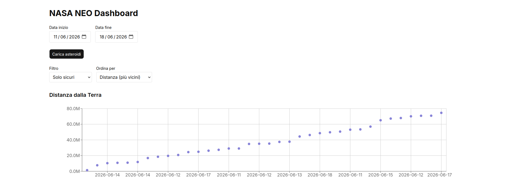
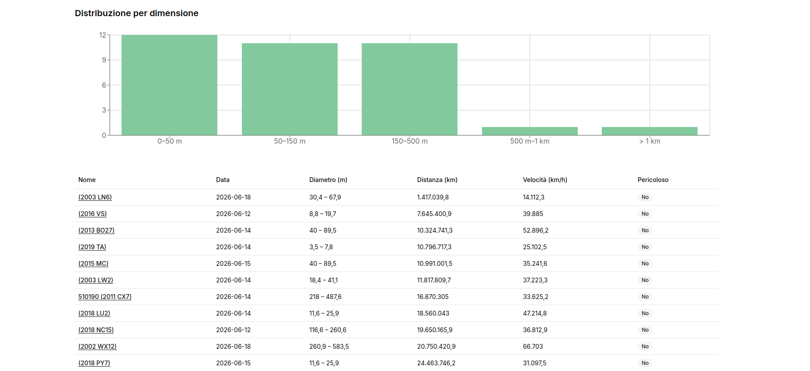
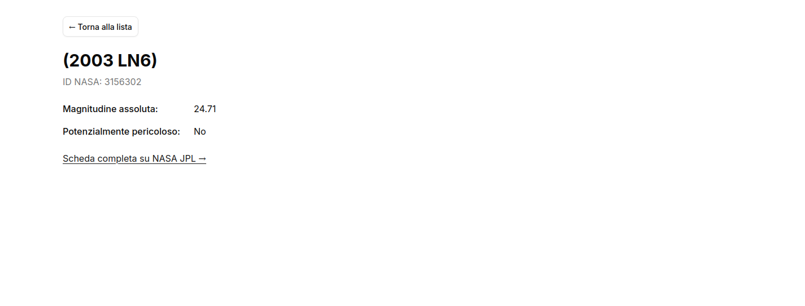

# NASA NEO Dashboard

Dashboard full-stack per esplorare gli asteroidi near-Earth (NEO) monitorati dalla NASA. L'utente seleziona un intervallo di date e visualizza gli asteroidi in transito ravvicinato con la Terra, con filtri, ordinamento, grafici e schede di dettaglio.

**Demo live:** https://nasa-neo-six.vercel.app
**Repository:** https://github.com/FontaMatte/nasa-neo

> Nota: il backend è ospitato sul piano gratuito di Render, che mette il servizio in pausa dopo 15 minuti di inattività. La prima richiesta dopo una pausa può richiedere 30-50 secondi (cold start); le successive sono immediate.

---

## Screenshot





---

## Stack tecnologico

**Backend**
- Python 3 + FastAPI
- httpx (client HTTP asincrono verso l'API NASA)
- Uvicorn (server ASGI)
- Deploy su Render

**Frontend**
- Next.js 14 (App Router) + TypeScript
- Tailwind CSS + shadcn/ui (componenti)
- Recharts (grafici)
- Deploy su Vercel

**Dati**
- [NASA NeoWs API](https://api.nasa.gov/) (Near Earth Object Web Service)

---

## Funzionalità

- **Ricerca per intervallo di date** con selettori nativi, caricamento automatico di un range di default all'avvio.
- **Tabella degli asteroidi** con nome, data, diametro stimato, distanza minima, velocità relativa e indicatore di pericolosità.
- **Filtri** (tutti / solo pericolosi / solo sicuri) e **ordinamento** (per data, distanza, dimensione), applicati lato client in tempo reale sui dati già scaricati.
- **Grafici**: dispersione distanza/data e istogramma della distribuzione per fasce di diametro.
- **Scheda di dettaglio** per ogni asteroide (rotta dinamica), con dati orbitali e link alla scheda NASA JPL.
- **Stati UX curati**: skeleton di caricamento, messaggi per risultati vuoti, box di errore.

---

## Scelte architetturali

Questa sezione documenta il *perché* dietro le decisioni principali — il cuore del progetto.

### Il backend come proxy intelligente

Il frontend non chiama mai direttamente la NASA. Tutte le richieste passano dal backend FastAPI, che funge da proxy. Questo permette di:

1. **Non esporre la chiave API NASA** al browser (resta una variabile d'ambiente lato server).
2. **Trasformare i dati** in una forma più comoda per il frontend: la NASA restituisce gli asteroidi raggruppati per data e con valori numerici serializzati come stringhe; il backend appiattisce la struttura in una lista e converte i tipi (es. distanza e velocità da stringa a numero, indispensabile per ordinare correttamente).
3. **Aggiungere caching e gestione del rate limit**, trasparenti per il frontend.

### Caching in-memory con TTL

Le risposte vengono messe in cache per ridurre le chiamate alla NASA (protezione del rate limit) e velocizzare le richieste ripetute. La cache è una semplice struttura in memoria con scadenza temporale (TTL di 1 ora): ogni voce salva il valore insieme al proprio istante di scadenza, e viene considerata valida solo finché non è scaduta.

### Chunking dei range di date

L'API NASA accetta un massimo di 7 giorni per chiamata. Per supportare intervalli più ampi, il backend suddivide il range richiesto in blocchi (chunk) da massimo 7 giorni, effettua una chiamata per blocco **in sequenza** (per non sovraccaricare l'API esterna con richieste parallele) e aggrega i risultati. Il frontend resta ignaro di tutto questo: invia un solo range, riceve una sola lista.

La cache lavora **a livello di singolo chunk**, non di intero range: questo consente il riuso dei blocchi anche tra richieste diverse. Per esempio, dopo aver richiesto il range 1-14 giugno, una successiva richiesta 8-21 giugno riutilizza dalla cache la settimana 8-14 già scaricata, chiamando la NASA solo per la parte mancante.

### Gestione degli errori a strati

Gli errori sono gestiti su due livelli, per mantenere separate le responsabilità:

- Il **client NASA** cattura gli errori tecnici di httpx (rate limit, irraggiungibilità, risorsa non trovata) e li traduce in eccezioni di dominio dedicate (`NasaRateLimitError`, `NasaUnavailableError`, `NasaNotFoundError`).
- Gli **endpoint** catturano le eccezioni di dominio e le traducono nei codici HTTP appropriati (429, 503, 404, 502) con messaggi chiari, che il frontend mostra all'utente.

Questo disaccoppiamento fa sì che gli endpoint non conoscano i dettagli della libreria HTTP usata, e che un eventuale cambio di libreria impatti solo il client.

### CORS

Il backend abilita il CORS solo per l'origine del frontend, configurata via variabile d'ambiente (`FRONTEND_URL`) per distinguere ambiente locale e produzione senza modificare il codice.

---

## Limiti noti e possibili evoluzioni

Scelte consapevoli, adeguate allo scopo del progetto ma migliorabili:

- **La cache è in-memory e non persistente**: vive nel processo del backend, quindi si svuota a ogni riavvio/deploy e a ogni risveglio dallo sleep di Render. Inoltre non è condivisa tra più istanze. *Evoluzione:* sostituirla con Redis per persistenza e condivisione.
- **Riuso dei chunk solo tra range allineati**: i blocchi sono calcolati a partire dalla data di inizio richiesta, quindi due range che iniziano in giorni diversi producono blocchi sfalsati e non riutilizzabili tra loro. *Evoluzione:* allineare i chunk a settimane di calendario fisse.
- **Chiamate ai chunk in sequenza**: scelta deliberata per rispettare il rate limit, al costo di una maggiore latenza sui range lunghi. *Evoluzione:* parallelizzazione controllata con un limite di concorrenza.
- **La scheda di dettaglio usa il tipo `any`**: la risposta di dettaglio della NASA è ampia e complessa, e non è stata tipizzata in TypeScript. *Evoluzione:* definire un'interfaccia almeno per i campi effettivamente utilizzati.
- **Lo stato della lista si perde navigando al dettaglio e tornando indietro**: lo stato vive nel componente della home, che viene rimontato al ritorno. *Evoluzione:* sollevare lo stato a un livello superiore o introdurre una cache lato client.
- **Gli errori non vengono messi in cache**: una richiesta di dettaglio per un id inesistente colpisce la NASA ogni volta. Accettabile data la rarità del caso.
- **Cold start su Render** (piano gratuito): prima richiesta lenta dopo un periodo di inattività.

---

## Eseguire il progetto in locale

### Prerequisiti

- Python 3.10+ e `pip`
- Node.js 18+ e `npm`
- Una chiave API NASA gratuita da [api.nasa.gov](https://api.nasa.gov/)

### Backend

```bash
cd backend

# crea e attiva l'ambiente virtuale
python3 -m venv venv
source venv/bin/activate        # su Windows: venv\Scripts\activate

# installa le dipendenze
pip install -r requirements.txt

# crea il file .env con la tua chiave NASA
echo "NASA_API_KEY=la_tua_chiave_qui" > .env

# avvia il server
uvicorn app.main:app --reload
```

Il backend è disponibile su `http://localhost:8000`. La documentazione interattiva (Swagger) è su `http://localhost:8000/docs`.

Variabili d'ambiente del backend:

| Variabile | Obbligatoria | Default | Descrizione |
|---|---|---|---|
| `NASA_API_KEY` | sì | — | Chiave dell'API NASA |
| `FRONTEND_URL` | no | `http://localhost:3000` | Origine autorizzata per il CORS |

### Frontend

In un secondo terminale:

```bash
cd frontend

# installa le dipendenze
npm install

# avvia il server di sviluppo
npm run dev
```

Il frontend è disponibile su `http://localhost:3000`.

Variabili d'ambiente del frontend:

| Variabile | Obbligatoria | Default | Descrizione |
|---|---|---|---|
| `NEXT_PUBLIC_API_URL` | no | `http://localhost:8000` | URL del backend |

In locale il default è sufficiente. In produzione va impostata con l'URL del backend deployato.

> Per lavorare in locale servono entrambi i server attivi contemporaneamente, in due terminali separati.

---

## Endpoint principali del backend

| Metodo | Endpoint | Descrizione |
|---|---|---|
| `GET` | `/` | Health check |
| `GET` | `/api/neos?start_date=&end_date=` | Lista asteroidi nel range (con chunking e cache) |
| `GET` | `/api/neos/{id}` | Dettaglio di un singolo asteroide |

---

## Contesto

Progetto realizzato a scopo didattico, come esercizio full-stack di integrazione con un'API esterna, gestione di caching e rate limit, e deploy in produzione.
